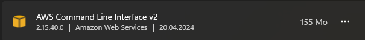
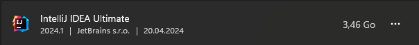
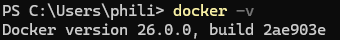
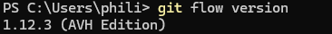
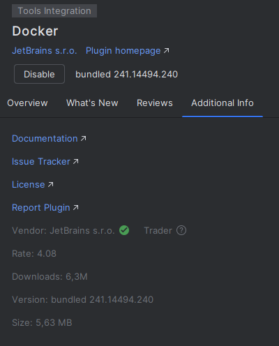
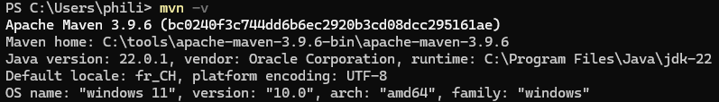

# Labo01 - Environment Setup

* [Labo description](https://cpnv-es-ngy.gitbook.io/vir1/labs/labo01-environment-setup)

## DevOps Stack to setup

Mention in this documentation the orders carried out and the results obtained.

If you have opted for a graphical installation, provide screenshots and describe the procedure up to the result obtained.

### Cloud cmd line interface - AWS Cli


- https://awscli.amazonaws.com/AWSCLIV2.msi




### IDE - Intellij


- https://www.jetbrains.com/idea/download/download-thanks.html?platform=windows




### Containers Engins - Docker

- https://desktop.docker.com/win/main/amd64/Docker%20Desktop%20Installer.exe?utm_source=docker&utm_medium=webreferral&utm_campaign=dd-smartbutton&utm_location=module&_gl=1*bwh3cn*_ga*NjgwMzUxNjc1LjE3MTM2Mzg3MzA.*_ga_XJWPQMJYHQ*MTcxNDAyNzc2Ni4zLjEuMTcxNDAyNzgxNS4xMS4wLjA.




### Versioning - Git + Git flow

- https://git-scm.com/download/win




### IDE Plugin - Docker plugin for IntelliJ

- Download the plugin from the IntelliJ marketplace



### Development Kit - JDK

- https://download.oracle.com/java/22/latest/jdk-22_windows-x64_bin.msi


### Package manager - Maven

- https://dlcdn.apache.org/maven/maven-3/3.9.6/binaries/apache-maven-3.9.6-bin.zip
- https://maven.apache.org/install.html



## Schema

Show your development environment, mentioning all the components in the stack.

Identify the links between components.

```
//TODO Schema
```

## Analysis

Answer the questions below, giving reasons for your answer (link, source).

### AWS CLI

* How does the AWS Cli interact with the cloud ?

```
//TODO answer the question
```

* What other ways do we have of dialoguing/interacting with the AWS cloud if we wanted to do without the CLI?

```
//TODO answer the question
```

* What commands do I need to run in the CLI to start an ec2 instance?

```
//TODO answer the question
```

### Docker Engine

* What type of hypervisor does Docker use?

```
//TODO answer the question
```

* What role does the Docker Desktop play in the Docker architecture?

```
//TODO answer the question
```

### Java Environment

* JDK, JRE, JVM... what's the difference?

```
//TODO answer the question
```

### Maven

* What is the command you need to use Maven to retrieve dependencies (and only that)?

```
//TODO answer the question
```


